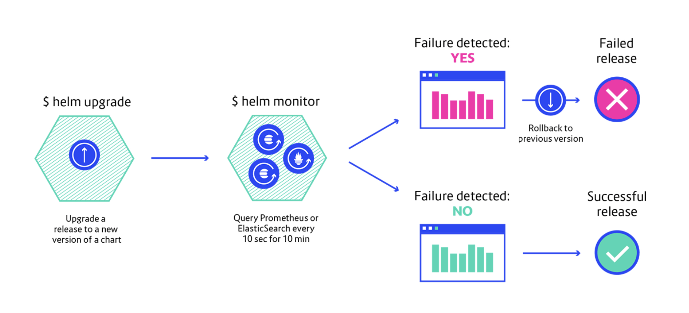

Helm Monitor plugin
===================

> Monitor a release, rollback to a previous version depending on the result of
a PromQL (Prometheus), events (Sentry), Lucene or DSL query (ElasticSearch).


## Demo

<a href="https://asciinema.org/a/SKViqDmByVLgv14F9hrlYX9qs" target="_blank"></a>

## Install

```bash
$ helm plugin install https://github.com/ContainerSolutions/helm-monitor
```

## Usage



A rollback happen only if the number of result from the query is greater than 0.

You can find a step-by-step example in the `./examples` directory.

### Prometheus

Monitor the **peeking-bunny** release against a Prometheus server, a rollback
is initiated if the 5xx error rate is over 0 as measured over the last 5
minutes.

```bash
$ helm monitor prometheus peeking-bunny 'rate(http_requests_total{code=~"^5.*$"}[5m]) > 0'
```

You can connect to a given Prometheus instance, by default it will connect to
*http://localhost:9090*.

```bash
$ helm monitor prometheus --prometheus=http://prometheus:9090 \
    peeking-bunny \
    'rate(http_requests_total{code=~"^5.*$"}[5m]) > 0'
```

### ElasticSearch

Monitor the **peeking-bunny** release against an ElasticSearch server, a
rollback is initiated if the 5xx error rate is over 0 for the last minute.

Using a Lucene query:

```bash
$ helm monitor elasticsearch peeking-bunny 'status:500 AND kubernetes.labels.app:app AND version:2.0.0'
```

Using a query DSL file:

```bash
$ helm monitor elasticsearch peeking-bunny ./query.json
```

You can connect to a given ElasticSearch instance, by default it will connect to
*http://localhost:9200*.

```bash
$ helm monitor elasticsearch --elasticsearch=http://elasticsearch:9200 \
    peeking-bunny \
    'status:500 AND kubernetes.labels.app:app AND version:2.0.0'
```

### Sentry

Monitor the **peeking-bunny** release against a Sentry server, a rollback is
initiated if the number of events is over 0 for the release 2.0.0:

```bash
$ helm monitor sentry my-app \
    --api-key <SENTRY_API_KEY> \
    --organization sentry \
    --project my-project \
    --sentry http://sentry:9000 \
    --tag release=2.0.0 \
    --regexp
    'Error with database connection.*'
```


## Docker

You can also use the Helm monitor backed Docker image to monitor:

```bash
$ docker run -ti -v $HOME/.kube:/root/.kube containersol/helm-monitor \
    monitor prometheus --prometheus=http://prometheus:9090 my-release \
    'rate(http_requests_total{code=~"^5.*$"}[5m]) > 0'
```

## Development

Require Go >= 1.11.

```bash
# Clone the repo, then add a symlink to the Helm plugin directory:
$ ln -s $GOPATH/src/github.com/ContainerSolutions/helm-monitor ~/.helm/plugins/helm-monitor

# Build:
$ GOPATH="" GO111MODULE=on go build -o helm-monitor ./cmd/...

# Run:
$ helm monitor elasticsearch my-release ./examples/elasticsearch-query.json
```

## Todo

- Add more provider (ie: Sentry)
- Investigate tool for failure detection compared to previous time window
